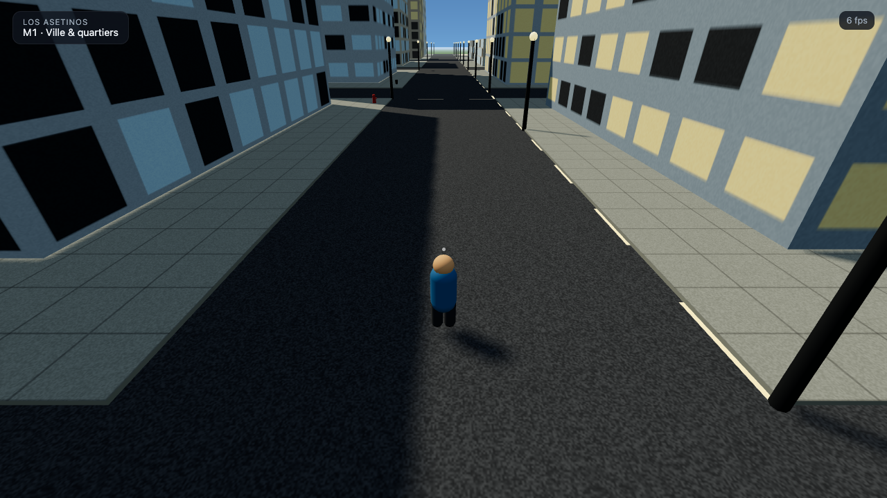
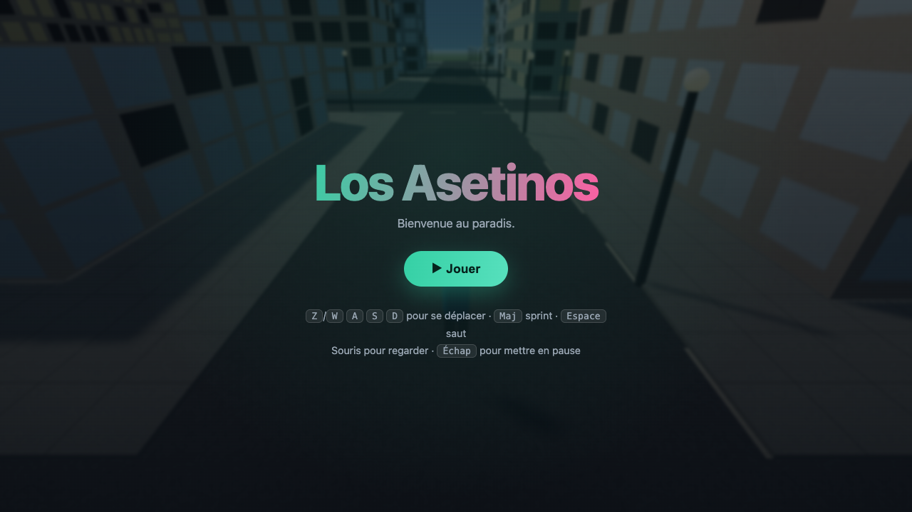

<div align="center">

# 🌴 Los Asetinos

**An open-world, GTA-style sandbox that runs entirely in your browser.**

Built with Three.js · TypeScript · Vite — an AI-assisted game-dev experiment,
engineered to a studio-grade standard.

<!-- Badges -->


<br/>


</div>

---

## What is this?

Los Asetinos is a browser game inspired by the *“24 h to build GTA 6”* experiment.
An AI acts as the **orchestrator** — imagining, coding and iterating on the game —
while specialised AI models can be plugged in to generate 3D models, textures,
sounds and cinematics.

The twist: it’s built like a **real production**, not a throwaway demo. Strict
TypeScript, a layered engine/game architecture, a fixed-timestep simulation, and
deterministic procedural generation. It runs **fully offline** with procedural
placeholder assets, and swaps them for AI-generated assets as provider keys are
configured — *without touching game code*.

## ✨ Highlights

- 🏙️ **Procedural city with districts** — a downtown core of glass towers,
  residential rings, parks and a beach strip, all zoned deterministically from a
  seed.
- 🌆 **Seamless world** — tileable procedural textures (asphalt, concrete, sand,
  grass), a gradient sky dome with a sun, and a daylight lighting rig.
- 🌴 **Street life** — palms, benches, hydrants and bins scattered per district.
- 🎮 **Third-person controller** — camera-relative movement, sprint, jump, mouse
  look, and AABB collision against every building.
- 🧱 **Studio-grade architecture** — engine and game cleanly separated; adding a
  feature means adding a *system*, not editing the loop.

<div align="center">
<table>
<tr>
<td width="50%"><br/><sub><b>Street level</b> — glass & masonry façades, lane markings, streetlights, shadows</sub></td>
<td width="50%"><br/><sub><b>Start menu</b> — the world renders live behind the title</sub></td>
</tr>
</table>
</div>

## 🚀 Quick start

```bash
npm install
npm run dev
```

Open the URL Vite prints (default http://localhost:5173) and press **▶ Jouer**.

> Tip: append `?play` to the URL to skip the menu and drop straight into the city
> (handy for demos and screenshots).

### Controls

| Action          | Key                        |
| --------------- | -------------------------- |
| Move            | `W` `A` `S` `D` / arrows   |
| Sprint          | `Shift`                    |
| Jump            | `Space`                    |
| Look around     | Mouse (click to capture)   |
| Pause / release | `Esc`                      |

## 🗺️ Roadmap

The build follows the iteration path of the source experiment, on a clean base.
Each milestone is independently playable — see [docs/ROADMAP.md](docs/ROADMAP.md).

| Milestone | Theme | Status |
| --------- | ----- | ------ |
| **M0** | Engine core + first playable city | ✅ done |
| **M1** | Districts, props, a city that looks alive | ✅ done |
| **M2** | Drivable vehicles + autonomous traffic | ⏳ next |
| **M3** | Pedestrians & world simulation (day/night, mini-map) | ⬜ |
| **M4** | Weapons, police & wanted system | ⬜ |
| **M5** | Missions, radio, interiors, flyable plane | ⬜ |
| **M6** | AI-generated assets, cinematics, perf pass | ⬜ |

## 🏛️ Architecture

Dependencies point **downward** only — the engine knows nothing about the game.
Full write-up in [docs/ARCHITECTURE.md](docs/ARCHITECTURE.md).

```
src/
  core/       loop, events, math, RNG, time — zero dependencies
  engine/     renderer, camera, input (Three.js glue)
  world/      city generation, districts, environment, sky
  entities/   player (vehicles & NPCs later)
  systems/    per-tick behaviour (movement, physics, AI…)
  gameplay/   game rules (missions, police, economy)
  assets/     procedural providers now; AI-backed later
  ui/         HUD, menus
  config/     tunable constants
```

## 🤖 AI-generated assets

The game ships with procedural assets so it runs with **zero external
dependencies**. To enable AI-generated 3D models, textures, audio and
cinematics, copy `.env.example` to `.env` and add provider keys. Design and
integration points: [docs/AI_ASSETS.md](docs/AI_ASSETS.md).

Secrets never ship in the client bundle — generation happens offline/at build
time, or behind a thin server proxy with spend limits.

## 🛠️ Scripts

| Command             | Description                             |
| ------------------- | --------------------------------------- |
| `npm run dev`       | Dev server with HMR                     |
| `npm run build`     | Type-check and build for production     |
| `npm run preview`   | Preview the production build            |
| `npm run typecheck` | TypeScript compiler (no emit)           |
| `npm run lint`      | Lint the source                         |
| `npm run format`    | Format with Prettier                    |

## 📝 License

[MIT](LICENSE) © zikmout

<sub>Assets are procedurally generated placeholders. AI asset generators are
trained on data of uncertain provenance; generated content is clearly marked and
this project is an experiment — verify licensing before any real use.</sub>
