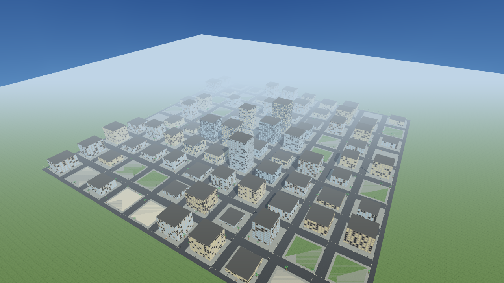
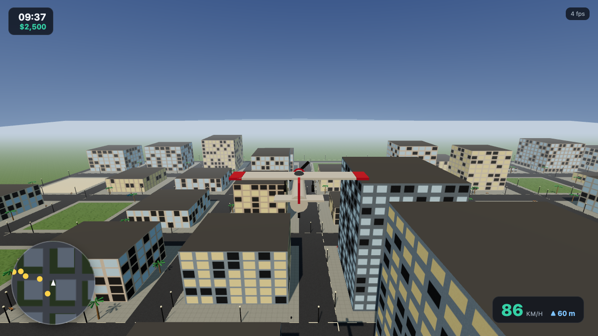
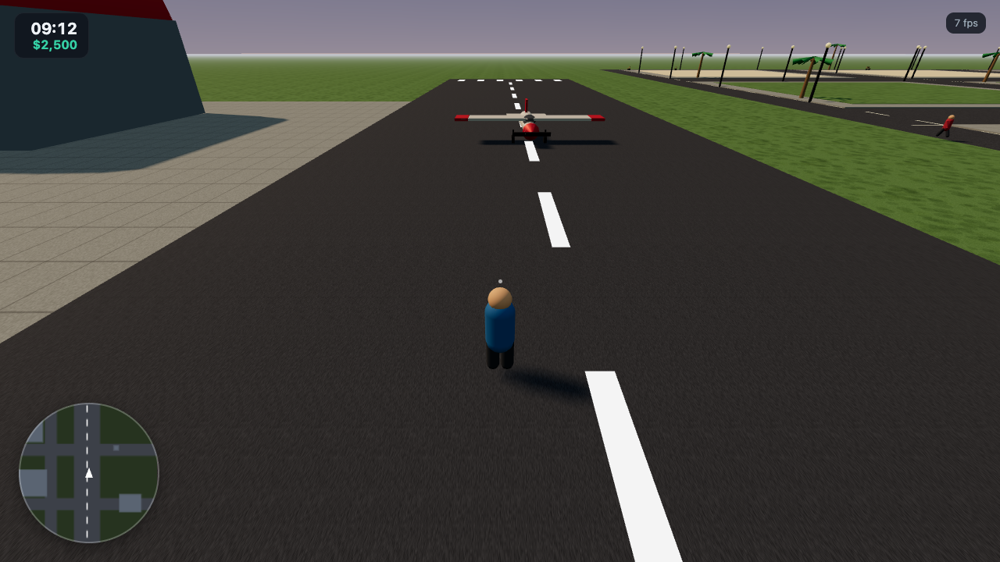
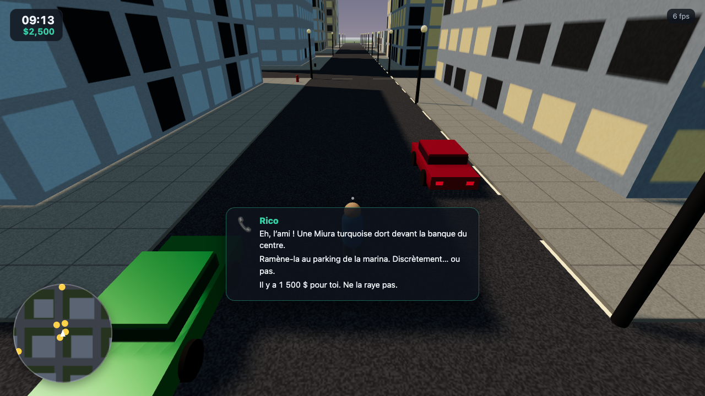
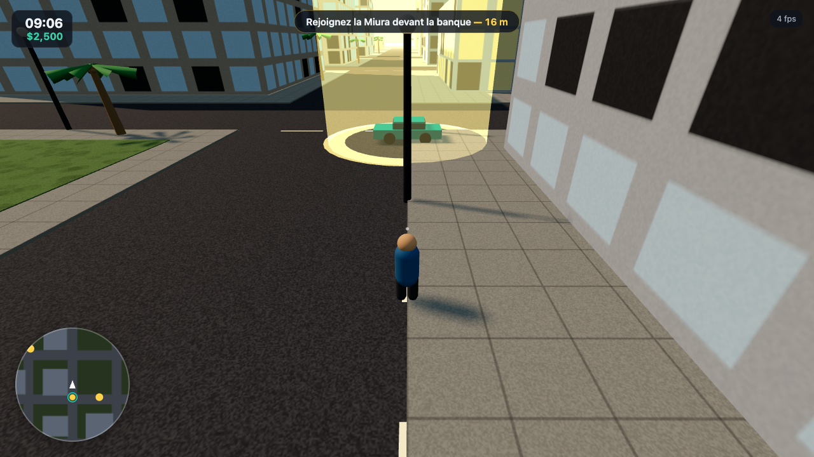
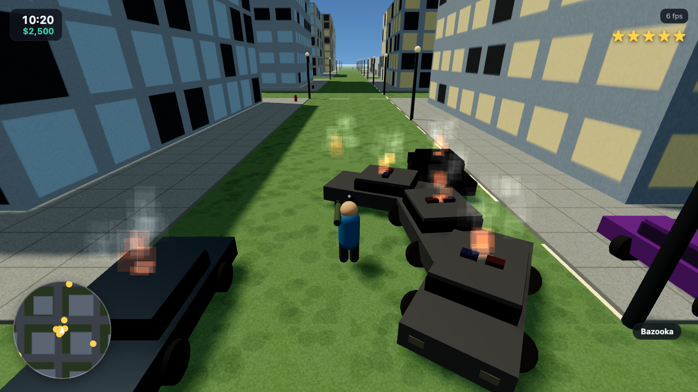
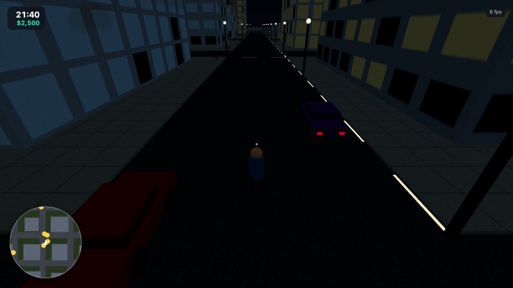
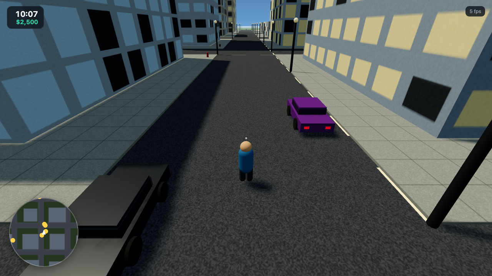
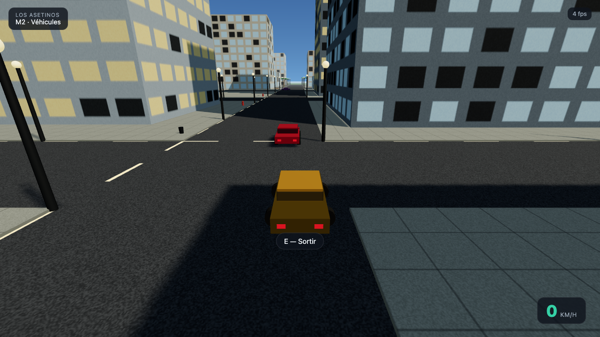

<div align="center">

# 🌴 Los Asetinos

**An open-world, GTA-style sandbox that runs entirely in your browser.**

Built with Three.js · TypeScript · Vite — an AI-assisted game-dev experiment,
engineered to a studio-grade standard.

<!-- Badges -->


<br/>



</div>

---

## What is this?

Los Asetinos is a browser game inspired by the *“24 h to build GTA 6”* experiment.
An AI acts as the **orchestrator** — imagining, coding and iterating on the game —
while specialised AI models can be plugged in to generate 3D models, textures,
sounds and cinematics.

The twist: it’s built like a **real production**, not a throwaway demo. Strict
TypeScript, a layered engine/game architecture, a fixed-timestep simulation, and
deterministic procedural generation. It runs **fully offline** with procedural
placeholder assets, and swaps them for AI-generated assets as provider keys are
configured — *without touching game code*.

## ✨ Highlights

- ✈️ **Airport & flyable plane** — an airfield east of the city (runway with
  painted markings, barrel-roof hangar, control tower) and a light aircraft
  with arcade flight: taxi, rotate past takeoff speed, climb/dive/bank, stall
  when too slow — and a fireball if you meet a building or the ground nose-first.
- 📞 **The "Rico" mission** — your phone rings a few seconds in: steal a
  turquoise Miura parked downtown, shake the 2-star pursuit it triggers, and
  deliver it to the marina parking for $1,500. Beacon checkpoints, a mini-map
  objective blip with live distance, phone-call dialogue, rewards — and if the
  Miura burns, Rico calls back to let you retry.
- 📻 **In-car radio** — press `R` while driving to cycle three procedurally
  synthesized stations (Web Audio, 16-step loops: kick, hats, bass, lead) —
  synthwave on *Asetinos FM*, beach skank on *Radio Playa*, breakneck *K-BOOM*.
- 🔫 **Weapons** — pistol, SMG and bazooka (visible in hand), hitscan shots with
  muzzle flash and impact sparks, and rockets with an area-of-effect blast.
- 🚓 **Wanted system & police** — crimes raise your star level; patrol cars with
  flashing light bars swarm in, box you in, and give up once the heat dies down.
  Cars you destroy become blackened, smoking wrecks.
- 🚗 **Drive anything** — walk up to a car, press `E`, and drive with arcade
  physics (throttle, brake, reverse, speed-sensitive steering) and a chase cam +
  speedometer.
- 🚦 **Living traffic** — autonomous cars flow through the road grid, follow
  lanes, turn at intersections and brake for each other and for you.
- 🚶 **Pedestrians** — 40 animated passers-by wander the sidewalks and scatter,
  arms up, when a car gets too close.
- 🌗 **Day/night cycle** — the sun sweeps the sky through dawn, day, dusk and
  night; streetlights fade on at dusk, the fog and sky palette follow the hour.
- 🗺️ **Mini-map & HUD** — a rotating mini-map with roads, buildings and traffic
  blips, plus an in-game clock and money counter.
- 🏙️ **Procedural city with districts** — a downtown core of glass towers,
  residential rings, parks and a beach strip, all zoned deterministically from a
  seed.
- 🌆 **Seamless world** — tileable procedural textures (asphalt, concrete, sand,
  grass), a gradient sky dome with a sun, and a daylight lighting rig.
- 🌴 **Street life** — palms, benches, hydrants and bins scattered per district.
- 🎮 **Third-person controller** — camera-relative movement, sprint, jump, mouse
  look, and AABB collision against every building.
- 🧱 **Studio-grade architecture** — engine and game cleanly separated; adding a
  feature means adding a *system*, not editing the loop.

<div align="center">
<table>
<tr>
<td width="50%"><br/><sub><b>Flying</b> — banking over downtown, speed + altitude readout</sub></td>
<td width="50%"><br/><sub><b>Airport</b> — runway, hangar and the plane, mapped on the mini-map</sub></td>
</tr>
<tr>
<td width="50%"><br/><sub><b>Mission</b> — Rico calls: steal the Miura, deliver it to the marina</sub></td>
<td width="50%"><br/><sub><b>Checkpoint</b> — beacon over the Miura, objective + live distance, mini-map blip</sub></td>
</tr>
<tr>
<td width="50%"><br/><sub><b>Action</b> — 5 stars, bazooka out, smoking police wrecks after a rocket blast</sub></td>
<td width="50%"><br/><sub><b>Night</b> — streetlights on, lit windows, night palette</sub></td>
</tr>
<tr>
<td width="50%"><br/><sub><b>Day</b> — mini-map, clock & money HUD, parked cars</sub></td>
<td width="50%"><br/><sub><b>Driving</b> — chase cam, speedometer, and AI traffic sharing the road</sub></td>
</tr>
</table>
</div>

## 🚀 Quick start

```bash
npm install
npm run dev
```

Open the URL Vite prints (default http://localhost:5173) and press **▶ Jouer**.

> Tip: append `?play` to the URL to skip the menu and drop straight into the city
> (handy for demos and screenshots).

> Tips: `?drive` drops you straight into a car · `?hour=21` forces a time of day
> (try the city at night) · `?mission` makes Rico call right away (`?mission=go`
> skips the call and puts the checkpoint straight up) · `?fly` boards the plane
> on the runway (`?fly=air` starts you mid-flight over the city).

### Controls

**On foot**

| Action          | Key                        |
| --------------- | -------------------------- |
| Move            | `W` `A` `S` `D` / arrows   |
| Sprint          | `Shift`                    |
| Jump            | `Space`                    |
| Look around     | Mouse (click to capture)   |
| Enter car       | `E` / `F` (near a car)     |
| Weapons         | `1` pistol · `2` SMG · `3` bazooka · `H` holster |
| Fire            | Left mouse button          |
| Pause / release | `Esc`                      |

**Driving**

| Action              | Key            |
| ------------------- | -------------- |
| Accelerate / reverse| `W` / `S`      |
| Steer               | `A` / `D`      |
| Handbrake           | `Space`        |
| Radio (cycle)       | `R`            |
| Exit car            | `E` / `F`      |

**Flying** (board the plane at the airfield east of the city)

| Action                  | Key            |
| ----------------------- | -------------- |
| Throttle / brake        | `W` / `S`      |
| Turn (banks in the air) | `A` / `D`      |
| Pull up / dive          | `Space` / `Shift` |
| Exit (on the ground)    | `E` / `F`      |

## 🗺️ Roadmap

The build follows the iteration path of the source experiment, on a clean base.
Each milestone is independently playable — see [docs/ROADMAP.md](docs/ROADMAP.md).

| Milestone | Theme | Status |
| --------- | ----- | ------ |
| **M0** | Engine core + first playable city | ✅ done |
| **M1** | Districts, props, a city that looks alive | ✅ done |
| **M2** | Drivable vehicles + autonomous traffic | ✅ done |
| **M3** | Pedestrians & world simulation (day/night, mini-map) | ✅ done |
| **M4** | Weapons, police & wanted system | ✅ done |
| **M5** | First mission ("Rico") + in-car radio | ✅ done |
| **M5.5** | Airport + flyable plane | ✅ done |
| **M6** | AI-generated assets, cinematics, perf pass | ⏳ next |

## 🏛️ Architecture

Dependencies point **downward** only — the engine knows nothing about the game.
Full write-up in [docs/ARCHITECTURE.md](docs/ARCHITECTURE.md).

```
src/
  core/       loop, events, math, RNG, time — zero dependencies
  engine/     renderer, camera, input (Three.js glue)
  world/      city generation, districts, environment, sky
  entities/   player (vehicles & NPCs later)
  systems/    per-tick behaviour (movement, physics, AI…)
  gameplay/   game rules (missions, police, economy)
  assets/     procedural providers now; AI-backed later
  ui/         HUD, menus
  config/     tunable constants
```

## 🤖 AI-generated assets

The game ships with procedural assets so it runs with **zero external
dependencies**. To enable AI-generated 3D models, textures, audio and
cinematics, copy `.env.example` to `.env` and add provider keys. Design and
integration points: [docs/AI_ASSETS.md](docs/AI_ASSETS.md).

Secrets never ship in the client bundle — generation happens offline/at build
time, or behind a thin server proxy with spend limits.

## 🛠️ Scripts

| Command             | Description                             |
| ------------------- | --------------------------------------- |
| `npm run dev`       | Dev server with HMR                     |
| `npm run build`     | Type-check and build for production     |
| `npm run preview`   | Preview the production build            |
| `npm run typecheck` | TypeScript compiler (no emit)           |
| `npm run lint`      | Lint the source                         |
| `npm run format`    | Format with Prettier                    |

## 📝 License

[MIT](LICENSE) © zikmout

<sub>Assets are procedurally generated placeholders. AI asset generators are
trained on data of uncertain provenance; generated content is clearly marked and
this project is an experiment — verify licensing before any real use.</sub>
